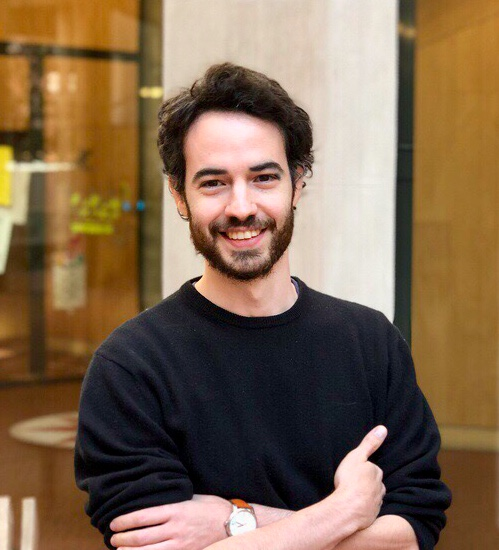

<!--  -->

	

> “Tous les peuples ont besoin d’immigrés et du rapport d’altérité posé par l’intermédiaire de leur venue. J’affirme même que la vitalité d’un peuple correspond à sa capacité d’être lui-même dans toutes ses composantes dans un devenir immigré.”
>
> Guattari F. (2009), Les années d’hiver 1980–1985, Les prairies ordinaires.

This web page is a little place that I sometimes visit. I stroll around, talk a bit, stretch my mind. There’s several different spaces here. There’s a space [about me](about/index.html) and this place, another about my current research [project]() on open source sustainability, and my [research]() in general. I may also write about [papers]() I read and liked or that incited me to write. I’m frequently (workload allowing) present on micro-blogging [platforms](). Occasionally, I may just write about anything that comes to mind in the [blurbs]() section.

<!-- I study **information systems from a social science perspective**. My main research interests are in alternative forms of participation such as **open source studies**, **open innovation**, **citizen science**, the **collaborative economy**, and how these influence **information systems development**. I am currently a [**Marie Curie Research Fellow**](http://cchs.csic.es/en/user/4030) at the Spanish National Research Council (CSIC) and remain affiliated to the UAM--Accenture Chair at the Universidad Autónoma de Madrid in the School of Economics and Business Studies. Previously, I helped write the European Union-funded proposal _Stars4All_ to the CAPS2020 call of the H2020 programme. I also served as a Research Fellow for that project and was responsible for developing structures and processes to create sustainable and participative citizen-scientist communities. Blub.

I have an MEng in computer science from University College London (UCL), an MSc in information systems (LSE), and a **PhD in information systems and innovation from the London School of Economics (LSE)** completed in 2015. -->

## News

April 18--20, 2018, AOM specialised conference on big data and society, Surrey, UK

February 22, 2018, First FSFE Madrid chapter meeting

November 6--18tth, 2017, [Collective Intelligence for Democracy](http://medialab-prado.es/article/collective-intelligence-for-democracy-2017-call-for-collaborators?lang=en) hackathon, MediaLab, Madrid, Spain

October 14-15th, 2017 &rarr; Going to the [NHS Hackday](http://www.nhshackday.com) in Gloucester!

September 29th, 2017 &rarr; Presenting my project at *Espacio Fundación Telefónica* for the [European Researchers' Night](http://ec.europa.eu/research/mariecurieactions/about/european-researchers-night_en)

September 6th, 2017 &rarr; Presenting my project at CSIC to the European Commision.

July 8th, 2017 &rarr; Presenting at EGOS on the gig economy as part of the infrastructure track.
